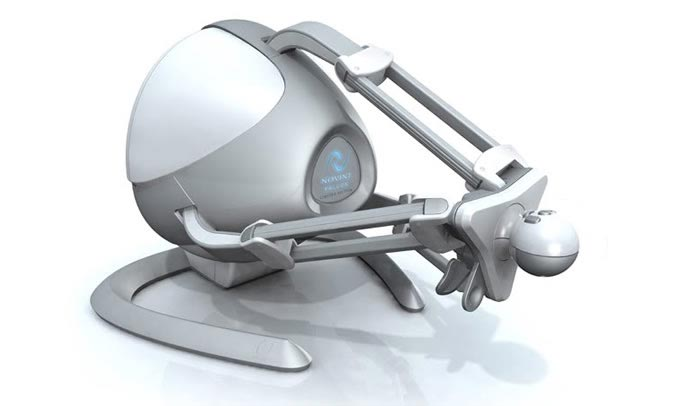

# Murphy's Law

I wrote all the code in this repository, and animated both the bat and the crocodile.  
Most of other graphical elements were made by [Emilien Grude](https://www.artstation.com/scraick), [Clea Hemmendinger](https://www.clea-he.com/) and Charles Hernoux.  
If you want to see more artwork, check [Emilien Grude's Artstation](https://www.artstation.com/artwork/EO0on).

## Table of contents
[The game](#the-game)  
[User interface](#user-interface)  
[Videos](#Videos)  
[Devices used](#devices-used) 

## The game
According to Wikipedia, Disco music emerged in the early 1970s in New York. Murphy, both archaeologist and adept of disco, disagrees and believes that Disco came from Ancient Egypts. He explores a pyramide to prove himself right.  
Seth, an ancient deity, traps Murphy in the pyramide but Horus, an other ancient deity, comes to Murphy's rescue. 

This game is made for two players, the first one incarnates Murphy while the other one plays Horus.  
Murphy is played with a classic controller, from a third person view. He can move, jump and pick up orbs for Horus. Because Horus helps Murphy, Seth diminushes Horus' strength, orbs collected regenerate Horus.  
Horus is played with an aptic device, and gravitates around Murphy and protects him from the deadly traps left by Seth. When Horus loses strength, the aptic arm exerts a force down, hindering the player.
Horus can also use a special ability, pushing Murphy to help him jump over traps that would be too big otherwise.  
Because this gameplay is asymetrical and complementaty, it promotes communication and coordination between the players, leading to a very entertaining gameplay.

## User interface

## Videos
Trailer : https://www.youtube.com/watch?v=EIIizz38mJA

Credits : https://www.youtube.com/watch?v=VZ81CNMiRgo

## Devices used
Aptic device - Novint Falcon : 

